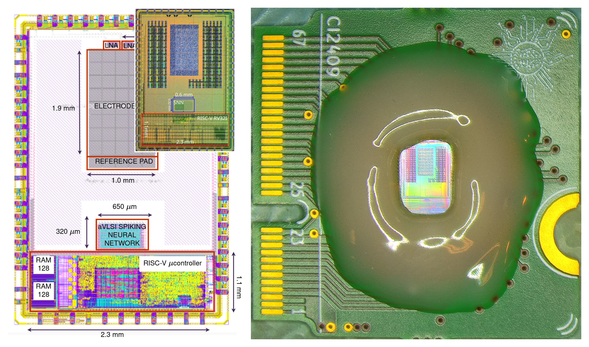

# OSCAR — Open-Silicon Chemosensing Analog RISC-V array

OSCAR is a public, self-contained release of a fabricated mixed-signal
neuromorphic chip, with the data and scripts to **replot the results** (a small
number of manually composed assets are noted in `docs/PLOTTING.md`). The die,
designed with the open SkyWater 130-nm PDK through
the Efabless Caravel/Caravan harness, couples a capacitively coupled low-noise
amplifier (LNA) and an exposed TiO₂-coated chemosensing electrode pad to an
analog spiking neural network (SNN) of sixteen leaky-integrate-and-fire (LIF)
neurons with 512 current-mode differential-pair-integrator (DPI) synapses
(16 excitatory + 16 inhibitory per neuron, 4-bit weights). A VexRiscv RV32I core manages the analog
array entirely through a digital four-phase address-event (AER) interface:
programming weights and routes, pacing stimuli, wiring on-die recurrence,
timestamping output spikes, and running calibration and read-out firmware.

OSCAR ships (a) the chip **design** sources (schematic, layout, GDS, LVS,
netlists, test files), (b) the RISC-V **firmware** and the host-side Python
bridge/control layer, and (c) the archived **data** plus the plotting scripts
that regenerate the figures and tables of the measured results.

> **This repository is a self-contained release.** OSCAR provides the *design
> sources, firmware, host layer, archived data and the plotting code* that
> reproduce the results.

## Hardware overview

- **Process / harness:** SkyWater 130-nm CMOS, Efabless Caravel/Caravan
  (open PDK, open toolchain).
- **Analog:** electrode + reference pads; two capacitively coupled LNAs (one
  pad-coupled, one pin-driven); a 16-neuron analog spiking neural network (SNN)
  of LIF somas; 512 DPI synapses (16 exc + 16 inh per neuron, 4-bit); bias
  currents are the only analog input, set by board DACs.
- **Digital:** VexRiscv RV32I, SRAM, boot flash, memory-mapped AER bridge; 21-bit
  spike timestamps; 4-phase req/ack; stimuli as address/sign words.
- **Clocking:** 10 MHz crystal × on-die DLL → 100/N MHz (50, 33, 25, 20 MHz).

<a id="hardware-figure"></a>
### Figure — chip layout, fabricated die and daughter-board



*Vector version: [`docs/figures/fig_hardware_layout.pdf`](docs/figures/fig_hardware_layout.pdf).*

> **Caption.** Chip layout in SkyWater 130-nm CMOS: electrode pad interface,
> reference pad, two low-noise amplifiers, the aVLSI spiking neural network, and
> the RISC-V µcontroller (inset, top right: micrograph of the fabricated die;
> the blurred purple region contains additional test structures included in the
> tape-out). Right: the chip on its daughter-board, seated in the well that
> holds the droplet; the dashed circle marks the die, magnified in the inset.
>
> *Chip layout, fabricated die and daughter-board. Composed from the layout,
> die-micrograph and daughter-board image assets in `docs/figures/`.*

Additional design assets live in `docs/figures/`:

| Asset | Notes |
|---|---|
| `fig_hardware_layout.{pdf,png}` | README hardware figure (above). |
| `arch_overview.pdf` / `.png` | Architecture / system-overview float. |
| `domain_map.pdf` / `.png` | Domain map built from layout + die micrograph. |

## Repository layout

| Path | What it is |
|---|---|
| `design/` | Chip design sources: `gds/`, `mag/`, `xschem/`, `verilog/`, `netlists/`, `lef/`, `lvs/`, `netgen/`, `script/`, `python/`, `tools_visualization/`, `Makefile`. Apache-2.0. |
| `firmware/` | RISC-V firmware `neuron_handshake/` (+ prebuilt `binaries/*.hex`), shared `common/`, optional `variants/`. |
| `host/` | Host control layer: `neuron_bridge.py` (single FTDI owner), `meas_common.py`, `run_neuron_test.py`, `riscvprog.py` (`HKSPI`), `test_spike_timestamp.py`, bring-up `*.sh`. |
| `measurements/` | Bench campaigns and the plotting scripts: `lna/`, `wet_pad/`, `array/`, `olfaction/`, `reservoir/`, `plotting/`, `analysis/`. |
| `data/` | Archived result datasets: `olfaction/`, `synapse/`, `array/`, `biases/`. |
| `docs/` | `ARCHITECTURE.md`, `HARDWARE_TRAPS.md`, `BRINGUP.md`, `PLOTTING.md`, and exported `figures/`. |

## Fabrication, PDK and how to open the GDS

- **PDK:** SkyWater `sky130A` via open_pdks; Caravel-lite harness pinned in the
  design `Makefile` (SkyWater commit `f70d8ca…`, open_pdks `0fe599b…`, OpenLane
  tag `2024.08.15`, MPW tag `mpw-9k`).
- **Open the wrapper:** `klayout design/gds/user_analog_project_wrapper.gds`.
  The Magic flow is documented in `design/gds/README.md` (e.g. `gds read
  RF_pads.gds`, `cellname top`, `load TOP`).
- **Design-flow entry point:** `design/Makefile`. It pulls caravel-lite into
  `./caravel`, the management core into `./mgmt_core_wrapper`, and PDK/OpenLane
  into `./dependencies/pdks` and `./dependencies/openlane_src`.

## Sensors / bias caveat (read before touching the bench)

- Synaptic efficacy and firing rate are strongly **operating-point dependent and
  clock-dependent**. Always retune biases at the clock you run.
- The on-die **DLL setting resets on a power cycle** — after power-up the chip
  runs on the 10 MHz crystal. Re-engage it, and **flash on the crystal**.
- The **AER encoder can latch** (all-ones *or* off-by-one address); a physical
  power cycle clears it. Run an unmasked 16-neuron addressing check
  before/after every acquisition.
- Bias polarity: **NMOS** higher V = more current; **PMOS** lower V = more
  current (OFF = VDD).

See [`docs/HARDWARE_TRAPS.md`](docs/HARDWARE_TRAPS.md) for the full list, and
[`docs/BRINGUP.md`](docs/BRINGUP.md) for the flashing/bring-up recipe.

## Reproducing the results

Plotting is first-class. Start from
[`docs/PLOTTING.md`](docs/PLOTTING.md), which maps each result
(what it plots) → data → script → output and documents the required
path-rewrite (`results/`→`data/`, `LNA/`→`measurements/`, …). Example:

```bash
# LNA transfer/noise
./.venv-meas/bin/python3 measurements/lna/clean_2026-08-26/scripts/make_figures.py

# TiO2 wet-transduction panels
./.venv-meas/bin/python3 measurements/wet_pad/scripts/tio2_combi.py

# Neuron FI insets
PYTHONPATH=. ./.venv-meas/bin/python3 \
    measurements/array/scripts/plot_fi_insets_all16.py --style compact \
    --out measurements/array/figures/neuron_fi_reference.pdf

# Weight-code words (--out resolves next to the script)
PYTHONPATH=. ./.venv-meas/bin/python3 \
    measurements/plotting/make_synapse_weight.py --panels b \
    --out weight_code_words.pdf
```

## Scope

OSCAR packages the chip **design** sources, the RISC-V **firmware** and prebuilt
images, the host Python **bridge/control** layer, the archived result
**datasets**, and the **plotting scripts** that regenerate the figures and
tables. `docs/PLOTTING.md` maps each result to its data and script and
documents how to recreate the plotting environment.

## License and citation

- Code and design: **Apache-2.0** (`LICENSE`); third-party notices in `NOTICE`.
- How to cite: [`CITATION.cff`](CITATION.cff).
